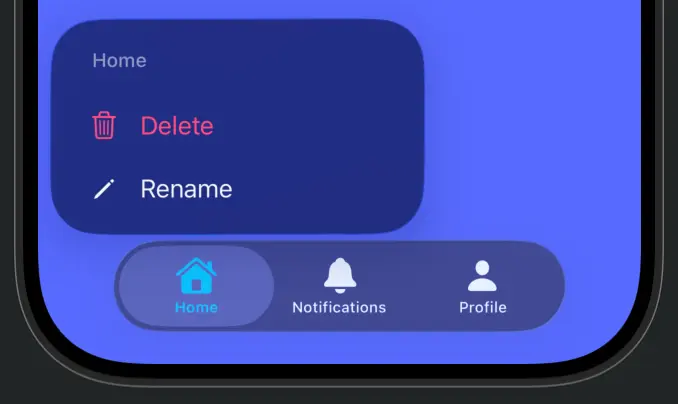
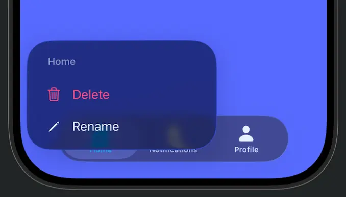

# TabBarMenu

TabBarMenu adds long-press context menus to `UITabBarController` tabs on iOS 18+.



## Requirements

- iOS 18.0+
- Swift 6.2 (Swift tools version in `Package.swift`)

## Installation

Add the package via Swift Package Manager in Xcode:

1. File > Add Packages...
2. Enter the repository URL
3. Add the `TabBarMenu` product to your target

## Usage

Conform to `TabBarMenuDelegate` and set `menuDelegate` on your tab bar controller.

```swift
import UIKit
import TabBarMenu

final class MainTabBarController: UITabBarController, TabBarMenuDelegate {
    override func viewDidLoad() {
        super.viewDidLoad()
        menuDelegate = self
    }

    func tabBarController(_ tabBarController: UITabBarController, tab: UITab?) -> UIMenu? {
        guard let tab else { return nil }
        let rename = UIAction(title: "Rename") { _ in
            // Handle rename
        }
        let delete = UIAction(title: "Delete", attributes: .destructive) { _ in
            // Handle delete
        }
        return UIMenu(title: tab.title, children: [rename, delete])
    }
}
```

`tab` is `nil` for the system More tab. Return `nil` to disable the menu for a given tab. Set `menuDelegate = nil` to remove menu handling.

If you configure the tab bar controller with `viewControllers`, conform to `TabBarMenuViewControllerDelegate` instead. `viewController` is `nil` for the system More tab.
TabBarMenu chooses the menu source based on which delegate protocol you adopt.

```swift
final class MainTabBarController: UITabBarController, TabBarMenuViewControllerDelegate {
    override func viewDidLoad() {
        super.viewDidLoad()
        menuDelegate = self
    }

    func tabBarController(_ tabBarController: UITabBarController, viewController: UIViewController?) -> UIMenu? {
        guard let viewController else { return nil }
        let tabBarItem = viewController.tabBarItem
        let rename = UIAction(title: "Rename") { _ in
            // Handle rename
        }
        return UIMenu(title: tabBarItem.title ?? "", children: [rename])
    }
}
```

## Configuration

Customize menu behavior via `menuConfiguration` (default minimum press duration is 0.35 seconds).
Set `maxVisibleTabCount` to the number of tabs shown before the system displays the More tab (default 5).

```swift
tabBarController.updateMenuConfiguration { configuration in
    configuration.minimumPressDuration = 0.5
    configuration.maxVisibleTabCount = 5
}
```

## Menu presentation

To customize the menu anchor point and configure the menu host button, implement the optional
delegate method that returns `TabBarMenuAnchorPlacement`. Return `nil` to keep the default
placement (inside the tab bar). You can also set `menuHostButton.preferredMenuElementOrder`
here if needed.

```swift
final class MainTabBarController: UITabBarController, TabBarMenuDelegate {
    func tabBarController(
        _ tabBarController: UITabBarController,
        configureMenuPresentationFor tab: UITab,
        tabFrame: CGRect,
        in containerView: UIView,
        menuHostButton: UIButton
    ) -> TabBarMenuAnchorPlacement? {
        .above()
    }
}
```

## TabBarMenuAnchorPlacement

- `.inside`: uses the default anchor point inside the tab bar.
- `.above(offset:)`: places the anchor above the tab bar. The default offset is 8 on iOS 26+, or -12 on earlier iOS versions.
- `.custom(CGPoint)`: uses a custom point in the container view's coordinate space.
- `.manual`: delegate sets `menuHostButton.frame` manually in `configureMenuPresentationFor`.

| Inside placement | Above placement |
| --- | --- |
|  |  |

## License

MIT. See [LICENSE](LICENSE).
