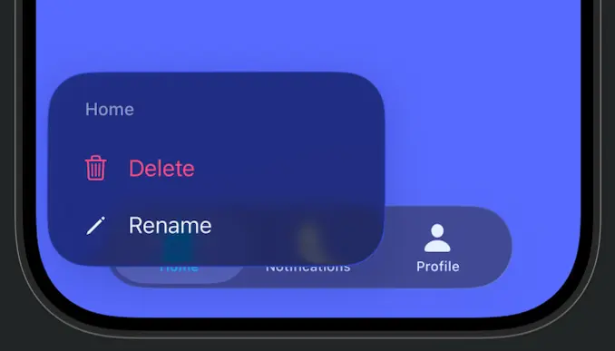

# TabBarMenu

**TabBarMenu** adds tap and long-press menus to `UITabBarController` on **iOS 18+**.
Prepare each interaction before UIKit changes selection, and receive a single
notification when someone selects or reselects tab content—including content in **More**.
Both `UITab` and classic `viewControllers` configurations are supported.

> This package relies on undocumented UIKit APIs and runtime behavior. Evaluate
> that constraint before using it in an App Store-bound project.


## Requirements

- iOS 18.0+
- Swift 6.2+

## Installation

In Xcode, choose **File → Add Packages…**, enter this repository's URL, and add
the **TabBarMenu** product to your target.

## Prepare an interaction

Set `menuDelegate` and return a `TabBarMenuPresentation` for interactions that
should show a menu. The delegate is held weakly.

```swift
import UIKit
import TabBarMenu

final class MainTabBarController: UITabBarController, TabBarMenuDelegate {
    override func viewDidLoad() {
        super.viewDidLoad()
        menuDelegate = self
    }

    func tabBarController(
        _ controller: UITabBarController,
        prepareFor interaction: TabBarInteraction,
        on item: TabBarItem
    ) -> TabBarMenuPresentation? {
        switch item {
        case .tab(let tab):
            guard interaction == .longPress else { return nil }
            let action = UIAction(title: "About this tab") { _ in
                print(tab.identifier)
            }
            return TabBarMenuPresentation(
                menu: UIMenu(title: tab.title, children: [action])
            )

        case .more(let tabs, let selectedTab):
            // Tapping active More content reselects it; long press keeps its menu.
            if interaction == .tap, selectedTab != nil { return nil }
            return TabBarMenuPresentation(
                menu: UIMenu(children: tabs.map {
                    controller.selectionAction(for: $0)
                }),
                anchorPlacement: .above(),
                preferredMenuElementOrder: .fixed
            )

        case .viewController, .moreViewControllers:
            return nil
        }
    }

    func tabBarController(
        _ controller: UITabBarController,
        didSelect selectedTab: UITab,
        previousTab: UITab?,
        isOverflow: Bool
    ) {
        if selectedTab === previousTab {
            // Run your existing re-tap action here, such as scrolling to the top.
            print("Reselected", selectedTab.identifier, "in More:", isOverflow)
        }
    }
}
```

`prepareFor` runs once after recognizing the gesture, before selection or menu
presentation. Returning a presentation consumes the interaction: it shows the
menu without selecting a tab or calling `didSelect`. Returning `nil` has the
following meaning:

| Interaction | Result of returning `nil` |
| --- | --- |
| Tap a regular tab | UIKit selects or reselects that tab. |
| Tap More while its content is active | Reselect that content without rebuilding its navigation stack. |
| Tap More with no active More content | Open UIKit's More list. |
| Long press | Do nothing. |

In `.more`, `selectedTab` is the content currently displayed through More, not
its last-used tab. It is `nil` when a regular tab or the More list is active.
Layout and programmatic selection do not call `prepareFor`.

## Receive selection results

`didSelect` reports actual content, never a synthetic More tab. `previousTab`
is the previously active content, or `nil` when there was none. Compare object
identities to detect reselection. `isOverflow` describes the selected tab's
placement at selection time; it does not indicate which gesture selected it.

Use `selectionAction(for:)` for menu entries that select a tab. Its action checks
current membership, enabled state, and the existing UIKit delegate's
`shouldSelect` decision, then selects the content and sends one `didSelect`.
Executing a menu action does not call `prepareFor` again.

For restoration and display synchronization, use `selectTabContent(_:)`. This
programmatic operation does not send a `TabBarMenuDelegate.didSelect` notification
or request a menu. It returns whether the content selection succeeded.

Your existing `UITabBarControllerDelegate` remains available for selection
permission and other UIKit behavior. Use `TabBarMenuDelegate.didSelect` as your
application's common selection handler for ordinary tabs, More reselection, and
selection actions. Native UIKit callbacks continue to be forwarded.

## Classic view-controller tab bars

When the controller uses `viewControllers`, preparation receives
`.viewController(UIViewController)` or
`.moreViewControllers(viewControllers:selectedViewController:)` instead.
Return presentations with the same rules and use the view-controller overload
of `selectionAction(for:)`. Selection is reported through:

```swift
func tabBarController(
    _ controller: UITabBarController,
    didSelect selectedViewController: UIViewController,
    previousViewController: UIViewController?,
    isOverflow: Bool
) {
    print(selectedViewController, previousViewController as Any, isOverflow)
}
```

## Presentation and configuration

`TabBarMenuPresentation` holds the menu, anchor placement, and element ordering
for one interaction. Its defaults are `.above()` and `.automatic` ordering.
Use `.fixed` when the menu should preserve its `children` array order.

Anchor placements are `.inside`, `.above(offset:)`, and `.custom(CGPoint)`.
Custom points are in the tab bar controller's view coordinates. TabBarMenu owns
the menu host button and applies these values internally.

| Inside placement | Above placement |
| --- | --- |
|  |  |

```swift
updateMenuConfiguration { configuration in
    configuration.minimumPressDuration = 0.5
    configuration.maxVisibleTabCount = 5
}
```

`maxVisibleTabCount` is a fallback; UIKit's actual More position and runtime limit
are preferred. Use `updateTabBarMenu` to replace the content of an already
presented menu while retaining its presentation choices. Set `menuDelegate = nil`
to detach the interaction handling and restore the original UIKit delegate.

## Migrating from 0.5.x

This is a breaking API change:

- Replace the individual tab and `menuForMoreTabWith` methods with
  `prepareFor:on:` and switch over `TabBarItem`.
- Return `TabBarMenuPresentation` instead of `UIMenu`.
- Move anchor placement and button element-order customization into the returned
  presentation. The presentation delegate and `.manual` placement are removed.
- Replace menu closures that call `selectTabContent` with `selectionAction(for:)`
  when they should trigger user-selection behavior.
- Move shared selection/reselection handling to the new `didSelect` callback.
  Keep programmatic `selectTabContent` calls for silent display synchronization.
- `TabBarMenuDelegate` is a Swift protocol with default implementations. The
  Objective-C content delegate and deprecated view-controller delegate alias
  are removed; classic view-controller support uses the same delegate.

## Documentation and demo

See the [API documentation](https://lynnswap.github.io/TabBarMenu/documentation/tabbarmenu/).
Open `Examples/TabBarDemo/TabBarDemo.xcodeproj` and run `TabBarDemo` to try either
content API. In the demo, tap active More content to reselect it and long-press
More to switch to another tab.

## License

MIT. See [LICENSE](LICENSE).
