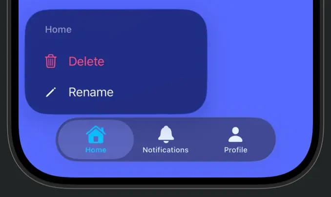

# TabBarMenu

Add tap and long-press menus to `UITabBarController`, including its **More** tab.
Works with both `UITab` and classic `viewControllers` configurations, with a
common callback for tab selections and reselections.



> [!WARNING]
> This package relies on undocumented APIs and runtime behavior, so extra care is needed before using it in App Store-bound projects.

## Installation

Requires **iOS 18+** and **Swift 6.2+**.

In Xcode, choose **File → Add Packages…**, enter this repository's URL, and add
the **TabBarMenu** product to your target.

## Quick start

Set `menuDelegate` on your tab bar controller and return a menu for the
interaction you want to handle. This example adds a tab-switching menu to More
in a controller whose `tabs` are already configured:

```swift
import UIKit
import TabBarMenu

final class MainTabBarController: UITabBarController, TabBarMenuDelegate {
    override func viewDidLoad() {
        super.viewDidLoad()
        menuDelegate = self
    }

    func tabBarController(
        _ controller: UITabBarController,
        prepareFor interaction: TabBarInteraction,
        on item: TabBarItem
    ) -> TabBarMenuPresentation? {
        guard case .more(let tabs, let selectedTab) = item else { return nil }

        // Tapping active More content reselects it; long press opens the menu.
        if interaction == .tap, selectedTab != nil { return nil }

        return TabBarMenuPresentation(
            menu: UIMenu(children: tabs.map { controller.selectionAction(for: $0) }),
            preferredMenuElementOrder: .fixed
        )
    }
}
```

Returning a presentation shows the menu without changing selection. Returning
`nil` lets a tap select or reselect content; a long press does nothing.
Use `selectionAction(for:)` for menu entries that select tabs.

The controller holds `menuDelegate` weakly. Keep a separate delegate alive for
as long as it is needed, or use the controller itself as above. Set
`menuDelegate = nil` to detach menu handling.

## Learn more

- [Usage guide](Sources/TabBarMenu/TabBarMenu.docc/UsingTabBarMenu.md) — regular-tab menus,
  selection callbacks, classic view-controller tab bars, and presentation options.
- [API reference](https://lynnswap.github.io/TabBarMenu/documentation/tabbarmenu/)
- [Migrating from 0.5.x](Sources/TabBarMenu/TabBarMenu.docc/MigratingFrom0_5.md)

To try it, open [TabBarDemo.xcodeproj](Examples/TabBarDemo/TabBarDemo.xcodeproj)
and run `TabBarDemo`. The demo supports both content APIs: tap active More
content to reselect it, or long-press More to switch tabs.

## License

MIT. See [LICENSE](LICENSE).
